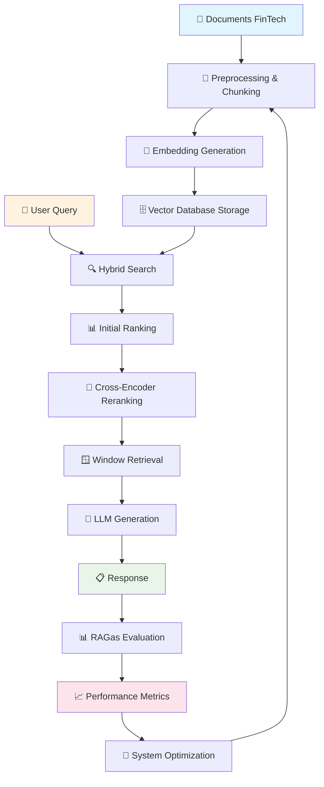
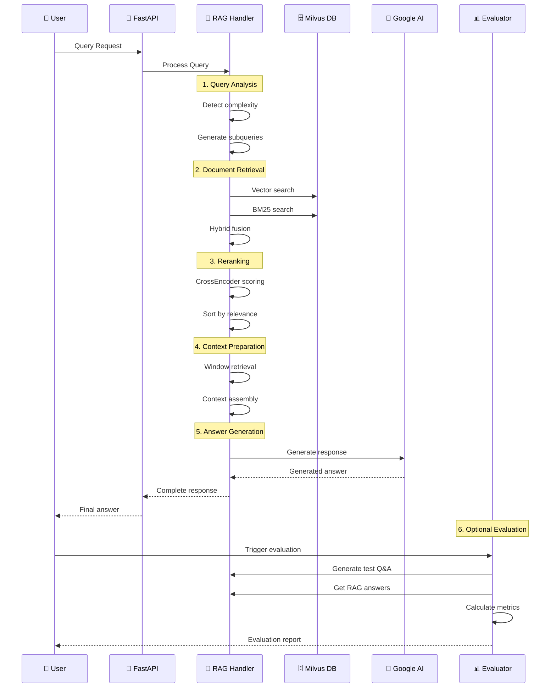
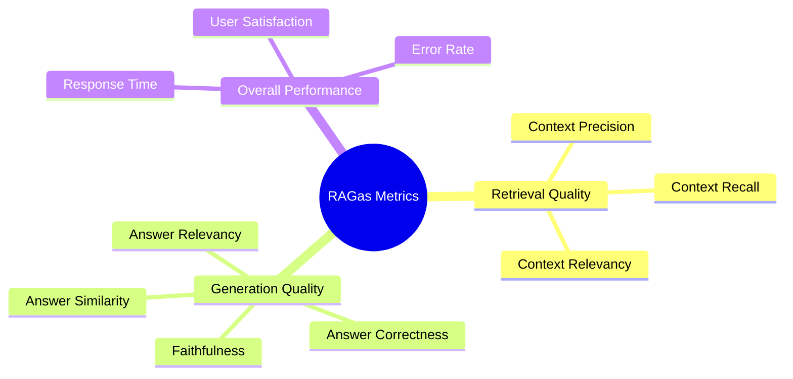

# 💸 FinTech RAG Chatbot - Système de Génération Augmentée par Récupération Avancé

<div align="center">


**🚀 Système RAG de nouvelle génération spécialisé dans le domaine FinTech**

[🎯 Fonctionnalités](#-fonctionnalités-principales) •
[🏗️ Architecture](#️-architecture-du-système) •
[📊 Métriques](#-métriques-dévaluation-rag) •
[🚀 Installation](#-installation-et-configuration) •
[📚 Documentation](#-documentation-technique)

</div>

---

## 📖 Table des Matières

- [🔍 Vue d'ensemble](#-vue-densemble-du-projet)
- [🎯 Fonctionnalités principales](#-fonctionnalités-principales)
- [🏗️ Architecture du système](#️-architecture-du-système)
- [🔬 Pipeline RAG détaillé](#-pipeline-rag-détaillé)
- [📊 Métriques d'évaluation RAG](#-métriques-dévaluation-rag)
- [🛠️ Installation et configuration](#️-installation-et-configuration)
- [🚀 Utilisation](#-utilisation)
- [🎨 Interface utilisateur](#-interface-utilisateur)
- [🧪 Tests et validation](#-tests-et-validation)
- [🎯 Optimisations avancées](#-optimisations-avancées)
- [📊 Métriques de production](#-métriques-de-production)
- [🔒 Sécurité et confidentialité](#-sécurité-et-confidentialité)
- [🚀 Déploiement](#-déploiement)
- [🔮 Roadmap](#-roadmap-et-améliorations-futures)
- [🤝 Contribution](#-contribution)
- [📄 Licence](#-licence)

---

## 🔍 Vue d'ensemble du Projet

### 🎯 **Objectif Principal**

Ce projet implémente un système RAG (Retrieval-Augmented Generation) de pointe spécialisé dans le domaine FinTech. Il combine les dernières avancées en IA pour fournir des réponses précises, contextuelles et fiables sur les sujets financiers, bancaires, blockchain et cryptomonnaies.

### 🌟 **Innovation Clé**

Le système intègre plusieurs techniques avancées :
- **Recherche hybride** (vectorielle + BM25)
- **Reranking intelligent** avec CrossEncoder
- **Window retrieval** pour un contexte élargi
- **Évaluation automatique** avec RAGas
- **Interface multi-modale** (Chat, Recherche, Évaluation)

### 🔄 **Flux de Fonctionnement Global**



---

## 🎯 Fonctionnalités Principales

### 🔥 **Fonctionnalités Core**

#### 💬 **Chat Assistant Intelligent**
- **Conversations contextuelles** avec mémoire de session
- **Réponses en temps réel** avec indicateurs de progression
- **Support multi-tours** pour des conversations approfondies
- **Formatage intelligent** des réponses avec citations

#### 🔍 **Recherche Documentaire Avancée**
- **Recherche sémantique** dans la base de connaissances
- **Scores de pertinence** détaillés avec explications
- **Prévisualisation** des passages trouvés
- **Historique des recherches** avec sauvegarde

#### 📊 **Évaluation RAG Automatisée**
- **7 métriques RAGas** complètes
- **Génération automatique** de Q&A de test
- **Visualisations interactives** des performances
- **Export des résultats** en CSV/JSON

### ⚡ **Fonctionnalités Techniques**

#### 🧠 **IA et Machine Learning**
- **Embeddings multilingues** avec SentenceTransformers
- **Recherche hybride** optimisée
- **Reranking neuronal** avec CrossEncoder
- **Génération contextuelle** avec Google AI Studio

#### 🗄️ **Gestion des Données**
- **Base vectorielle** Milvus haute performance
- **Indexation intelligente** avec métadonnées
- **Mise en cache** optimisée
- **Backup automatique** des données

#### 🎨 **Interface Utilisateur**
- **Design responsive** adaptatif
- **Mode sombre/clair** complet
- **Animations fluides** et feedback visuel
- **Accessibilité** conforme aux standards

---

## 🏗️ Architecture du Système

### 📋 **Vue d'ensemble Architecturale**

```mermaid
graph TB
    subgraph "🎨 Frontend Layer"
        A[Streamlit UI]
        A1[Chat Interface]
        A2[Search Interface]
        A3[Evaluation Interface]
        A --> A1
        A --> A2
        A --> A3
    end
    
    subgraph "🔌 API Layer"
        B[FastAPI Server]
        B1[/answer endpoint]
        B2[/search endpoint]
        B3[/rebuild endpoint]
        B --> B1
        B --> B2
        B --> B3
    end
    
    subgraph "🧠 Core RAG Engine"
        C[RAG Handler]
        C1[Document Processor]
        C2[Embedding Generator]
        C3[Search Engine]
        C4[Reranker]
        C5[Response Generator]
        C --> C1
        C --> C2
        C --> C3
        C --> C4
        C --> C5
    end
    
    subgraph "🗄️ Data Layer"
        D[Milvus Vector DB]
        E[Document Storage]
        F[Cache Layer]
    end
    
    subgraph "🤖 AI Services"
        G[Google AI Studio]
        H[SentenceTransformers]
        I[CrossEncoder]
    end
    
    subgraph "📊 Evaluation Layer"
        J[RAGas Evaluator]
        J1[Metrics Calculator]
        J2[Q&A Generator]
        J3[Performance Monitor]
        J --> J1
        J --> J2
        J --> J3
    end
    
    A --> B
    B --> C
    C --> D
    C --> E
    C --> F
    C --> G
    C --> H
    C --> I
    B --> J
    
    style A fill:#e3f2fd
    style B fill:#e8f5e8
    style C fill:#fff3e0
    style D fill:#f3e5f5
    style G fill:#ffebee
    style J fill:#e0f2f1
```

### 🧱 **Composants Détaillés**

#### 1️⃣ **RAG Handler (`rag_handlerDL4.py`)**

**Responsabilités :**
- Gestion complète du pipeline RAG
- Interface avec les services d'IA externes
- Optimisation des performances de recherche
- Gestion de la mémoire et du cache

**Classes principales :**
```python
class RAGHandler:
    def __init__(self):
        self.embedding_model = SentenceTransformer('all-MiniLM-L6-v2')
        self.cross_encoder = CrossEncoder('cross-encoder/ms-marco-MiniLM-L-6-v2')
        self.milvus_client = MilvusClient()
        self.google_client = GoogleGenerativeAI()
    
    # Méthodes principales
    def embed_text(self, text: str) -> List[float]
    def search_documents(self, query: str, top_k: int) -> List[Dict]
    def rerank_results(self, query: str, results: List[Dict]) -> List[Dict]
    def generate_answer(self, query: str, context: str) -> str
    def hybrid_pipeline(self, query: str, **kwargs) -> Dict
```

**Techniques avancées implémentées :**
- **Hypothetical Questions Generation** : Génération de questions hypothétiques pour améliorer la récupération
- **Sentence Window Retrieval** : Récupération avec fenêtre glissante pour plus de contexte
- **Complex Question Handling** : Décomposition des questions complexes en sous-questions
- **Adaptive Chunk Sorting** : Tri intelligent des chunks selon la pertinence

#### 2️⃣ **API FastAPI (`mainDL4.py`)**

**Architecture RESTful :**
```python
# Endpoints principaux
@app.post("/answer")
async def get_answer(request: QueryRequest) -> AnswerResponse

@app.post("/search") 
async def search_documents(request: SearchRequest) -> SearchResponse

@app.post("/rebuild")
async def rebuild_index() -> StatusResponse

@app.get("/ping")
async def health_check() -> HealthResponse
```

**Modèles Pydantic :**
```python
class QueryRequest(BaseModel):
    query: str
    top_k: int = 10
    final_k: int = 3
    window_size: int = 1
    use_reranking: bool = True

class AnswerResponse(BaseModel):
    answer: str
    sources: List[Dict]
    processing_time: float
    confidence_score: float
```

#### 3️⃣ **Interface Streamlit (`streamlit_app.py`)**

**Structure modulaire :**
```python
# Pages principales
def chat_page():
    """Interface de chat conversationnel"""
    
def search_page():
    """Interface de recherche documentaire"""
    
def evaluation_page():
    """Interface d'évaluation RAG"""

# Composants réutilisables
def load_css():
    """Gestion des thèmes dark/light"""
    
def display_message(message: Dict):
    """Affichage des messages formatés"""
    
def show_metrics(metrics: Dict):
    """Visualisation des métriques"""
```

#### 4️⃣ **Évaluateur RAG (`rag_evaluator.py`)**

**Classe principale :**
```python
class RAGEvaluator:
    def __init__(self, google_api_key: str):
        self.google_api_key = google_api_key
        self.available = RAGAS_AVAILABLE
        self.llm = ChatGoogleGenerativeAI(model="gemini-1.5-flash")
    
    def generate_ground_truth_qa(self, documents: List[Dict]) -> List[Dict]
    def get_rag_answers(self, questions: List[str]) -> Tuple[List[str], List[List[str]]]
    def evaluate_system(self, qa_pairs: List[Dict]) -> Tuple[Dict, Dict]
    def run_full_evaluation(self, **kwargs) -> Dict
```

---

## 🔬 Pipeline RAG Détaillé

### 🔄 **Flux de Traitement Complet**



### 1️⃣ **Préparation des Documents**

#### **Chargement et Parsing**
```python
def load_documents(docs_path: str) -> List[Document]:
    """
    Charge et parse les documents PDF du répertoire FinTech
    """
    documents = []
    for pdf_file in Path(docs_path).glob("*.pdf"):
        loader = PyPDFLoader(str(pdf_file))
        pages = loader.load()
        
        # Nettoyage et preprocessing
        for page in pages:
            cleaned_text = clean_text(page.page_content)
            if len(cleaned_text) > 100:  # Filtre de qualité
                documents.append(Document(
                    page_content=cleaned_text,
                    metadata={
                        "source": pdf_file.name,
                        "page": page.metadata.get("page", 0),
                        "file_size": pdf_file.stat().st_size,
                        "processed_at": datetime.now().isoformat()
                    }
                ))
    return documents
```

#### **Chunking Intelligent**
```python
def intelligent_chunking(documents: List[Document]) -> List[Document]:
    """
    Découpage intelligent préservant la cohérence sémantique
    """
    # Configuration du splitter
    text_splitter = RecursiveCharacterTextSplitter(
        chunk_size=500,
        chunk_overlap=50,
        length_function=len,
        separators=[
            "\n\n",  # Paragraphes
            "\n",    # Lignes
            ". ",    # Phrases
            "! ",    # Exclamations
            "? ",    # Questions
            ", ",    # Virgules
            " ",     # Espaces
            ""       # Caractères
        ]
    )
    
    chunks = []
    for doc in documents:
        # Chunking de base
        basic_chunks = text_splitter.split_documents([doc])
        
        # Post-processing pour améliorer la cohérence
        for chunk in basic_chunks:
            # Vérification de la qualité du chunk
            if is_quality_chunk(chunk.page_content):
                # Enrichissement des métadonnées
                chunk.metadata.update({
                    "chunk_size": len(chunk.page_content),
                    "word_count": len(chunk.page_content.split()),
                    "sentence_count": len(sent_tokenize(chunk.page_content)),
                    "quality_score": calculate_quality_score(chunk.page_content)
                })
                chunks.append(chunk)
    
    return chunks

def is_quality_chunk(text: str) -> bool:
    """Évalue la qualité d'un chunk"""
    # Critères de qualité
    min_length = 50
    max_repetition_ratio = 0.3
    min_unique_words = 10
    
    words = text.split()
    unique_words = set(words)
    
    # Vérifications
    if len(text) < min_length:
        return False
    if len(unique_words) < min_unique_words:
        return False
    if len(unique_words) / len(words) < (1 - max_repetition_ratio):
        return False
    
    return True
```

### 2️⃣ **Génération d'Embeddings**

#### **Configuration du Modèle**
```python
class EmbeddingGenerator:
    def __init__(self, model_name: str = "all-MiniLM-L6-v2"):
        self.model = SentenceTransformer(model_name)
        self.dimension = self.model.get_sentence_embedding_dimension()
        self.cache = {}
    
    def embed_text(self, text: str) -> List[float]:
        """Génère l'embedding d'un texte avec mise en cache"""
        # Normalisation du texte
        normalized_text = self.normalize_text(text)
        
        # Vérification du cache
        if normalized_text in self.cache:
            return self.cache[normalized_text]
        
        # Génération de l'embedding
        embedding = self.model.encode(
            normalized_text,
            normalize_embeddings=True,
            show_progress_bar=False
        ).tolist()
        
        # Mise en cache
        self.cache[normalized_text] = embedding
        
        return embedding
    
    def batch_embed(self, texts: List[str], batch_size: int = 32) -> List[List[float]]:
        """Génération d'embeddings par batch pour optimiser les performances"""
        embeddings = []
        
        for i in range(0, len(texts), batch_size):
            batch = texts[i:i + batch_size]
            batch_embeddings = self.model.encode(
                batch,
                normalize_embeddings=True,
                show_progress_bar=True,
                batch_size=batch_size
            )
            embeddings.extend(batch_embeddings.tolist())
        
        return embeddings
    
    def normalize_text(self, text: str) -> str:
        """Normalise le texte avant embedding"""
        # Nettoyage de base
        text = re.sub(r'\s+', ' ', text)  # Espaces multiples
        text = re.sub(r'[^\w\s.,!?-]', '', text)  # Caractères spéciaux
        text = text.strip().lower()
        
        return text
```

#### **Optimisations d'Embedding**
```python
# Techniques d'optimisation
def optimize_embeddings():
    """Optimisations pour améliorer la qualité des embeddings"""
    
    # 1. Preprocessing avancé
    def advanced_preprocessing(text: str) -> str:
        # Expansion d'acronymes FinTech
        acronym_dict = {
            "AI": "Artificial Intelligence",
            "ML": "Machine Learning",
            "DeFi": "Decentralized Finance",
            "NFT": "Non-Fungible Token",
            "KYC": "Know Your Customer",
            "AML": "Anti-Money Laundering"
        }
        
        for acronym, expansion in acronym_dict.items():
            text = re.sub(f"\\b{acronym}\\b", f"{acronym} {expansion}", text)
        
        return text
    
    # 2. Embedding ensembling
    def ensemble_embedding(text: str, models: List[SentenceTransformer]) -> List[float]:
        embeddings = []
        for model in models:
            emb = model.encode(text, normalize_embeddings=True)
            embeddings.append(emb)
        
        # Moyenne pondérée
        weights = [0.5, 0.3, 0.2]  # Poids selon la performance
        ensemble_emb = np.average(embeddings, axis=0, weights=weights)
        return ensemble_emb.tolist()
```

### 3️⃣ **Indexation Vectorielle avec Milvus**

#### **Configuration Avancée de Milvus**
```python
class MilvusManager:
    def __init__(self, uri: str = "http://localhost:19530"):
        self.uri = uri
        self.client = MilvusClient(uri=uri)
        self.collection_name = "fintech_documents"
        self.dimension = 384  # all-MiniLM-L6-v2
    
    def create_collection(self):
        """Crée la collection avec configuration optimisée"""
        # Schéma de la collection
        schema = MilvusClient.create_schema(
            auto_id=False,
            enable_dynamic_field=True
        )
        
        # Champs principaux
        schema.add_field(field_name="id", datatype=DataType.VARCHAR, 
                        max_length=100, is_primary=True)
        schema.add_field(field_name="embedding", datatype=DataType.FLOAT_VECTOR, 
                        dim=self.dimension)
        schema.add_field(field_name="text", datatype=DataType.VARCHAR, 
                        max_length=2000)
        schema.add_field(field_name="source", datatype=DataType.VARCHAR, 
                        max_length=200)
        schema.add_field(field_name="metadata", datatype=DataType.JSON)
        
        # Configuration de l'index
        index_params = {
            "metric_type": "COSINE",
            "index_type": "IVF_FLAT",
            "params": {"nlist": 2048}
        }
        
        # Création de la collection
        self.client.create_collection(
            collection_name=self.collection_name,
            schema=schema,
            index_params=index_params,
            consistency_level="Strong"
        )
    
    def insert_documents(self, documents: List[Dict]):
        """Insertion optimisée des documents"""
        # Préparation des données
        data = []
        for i, doc in enumerate(documents):
            data.append({
                "id": f"doc_{i}_{hash(doc['text'])%10000}",
                "embedding": doc["embedding"],
                "text": doc["text"][:2000],  # Limite de taille
                "source": doc.get("source", "unknown"),
                "metadata": doc.get("metadata", {})
            })
        
        # Insertion par batch
        batch_size = 1000
        for i in range(0, len(data), batch_size):
            batch = data[i:i + batch_size]
            result = self.client.insert(
                collection_name=self.collection_name,
                data=batch
            )
            print(f"Inserted batch {i//batch_size + 1}: {len(batch)} documents")
        
        # Flush pour garantir la persistance
        self.client.flush(collection_name=self.collection_name)
```

#### **Stratégies d'Indexation**
```python
def advanced_indexing_strategies():
    """Stratégies avancées d'indexation pour optimiser les performances"""
    
    # 1. Index hiérarchique
    def create_hierarchical_index():
        # Index principal pour recherche rapide
        main_index_params = {
            "metric_type": "COSINE",
            "index_type": "IVF_SQ8",
            "params": {"nlist": 2048}
        }
        
        # Index secondaire pour recherche précise
        precise_index_params = {
            "metric_type": "COSINE", 
            "index_type": "HNSW",
            "params": {"M": 16, "efConstruction": 200}
        }
    
    # 2. Partitionnement intelligent
    def create_partitions():
        partitions = {
            "blockchain": "Documents sur blockchain et crypto",
            "banking": "Documents bancaires traditionnels",
            "fintech": "Documents sur les innovations FinTech",
            "regulation": "Documents réglementaires",
            "general": "Documents généraux"
        }
        
        for partition_name, description in partitions.items():
            client.create_partition(
                collection_name="fintech_documents",
                partition_name=partition_name
            )
    
    # 3. Index adaptatif
    def adaptive_indexing():
        # Analyse des patterns de requête
        query_patterns = analyze_query_patterns()
        
        # Ajustement de l'index selon l'usage
        if query_patterns["high_precision_needed"]:
            use_hnsw_index()
        elif query_patterns["speed_critical"]:
            use_ivf_index()
        else:
            use_balanced_index()
```

### 4️⃣ **Recherche Hybride Avancée**

#### **Algorithme de Fusion Hybride**
```python
class HybridSearchEngine:
    def __init__(self):
        self.vector_search = VectorSearch()
        self.bm25_search = BM25Search()
        self.fusion_weights = {"vector": 0.7, "bm25": 0.3}
    
    def hybrid_search(self, query: str, top_k: int = 10) -> List[Dict]:
        """Recherche hybride combinant vectorielle et BM25"""
        
        # 1. Recherche vectorielle
        vector_results = self.vector_search.search(query, top_k=top_k*2)
        
        # 2. Recherche BM25
        bm25_results = self.bm25_search.search(query, top_k=top_k*2)
        
        # 3. Fusion des résultats
        fused_results = self.fuse_results(vector_results, bm25_results)
        
        # 4. Tri et sélection finale
        final_results = sorted(fused_results, 
                             key=lambda x: x["hybrid_score"], 
                             reverse=True)[:top_k]
        
        return final_results
    
    def fuse_results(self, vector_results: List[Dict], 
                    bm25_results: List[Dict]) -> List[Dict]:
        """Fusion intelligente des résultats"""
        
        # Normalisation des scores
        vector_scores = self.normalize_scores([r["score"] for r in vector_results])
        bm25_scores = self.normalize_scores([r["score"] for r in bm25_results])
        
        # Création de l'index de fusion
        result_map = {}
        
        # Ajout des résultats vectoriels
        for i, result in enumerate(vector_results):
            doc_id = result["id"]
            result_map[doc_id] = {
                **result,
                "vector_score": vector_scores[i],
                "bm25_score": 0.0,
                "vector_rank": i + 1
            }
        
        # Ajout des résultats BM25
        for i, result in enumerate(bm25_results):
            doc_id = result["id"]
            if doc_id in result_map:
                result_map[doc_id]["bm25_score"] = bm25_scores[i]
                result_map[doc_id]["bm25_rank"] = i + 1
            else:
                result_map[doc_id] = {
                    **result,
                    "vector_score": 0.0,
                    "bm25_score": bm25_scores[i],
                    "bm25_rank": i + 1
                }
        
        # Calcul du score hybride
        for doc_id, result in result_map.items():
            hybrid_score = (
                self.fusion_weights["vector"] * result["vector_score"] +
                self.fusion_weights["bm25"] * result["bm25_score"]
            )
            
            # Bonus pour les documents présents dans les deux recherches
            if result["vector_score"] > 0 and result["bm25_score"] > 0:
                hybrid_score *= 1.2  # Bonus de 20%
            
            result["hybrid_score"] = hybrid_score
        
        return list(result_map.values())
    
    def normalize_scores(self, scores: List[float]) -> List[float]:
        """Normalisation min-max des scores"""
        if not scores:
            return []
        
        min_score = min(scores)
        max_score = max(scores)
        
        if max_score == min_score:
            return [1.0] * len(scores)
        
        return [(score - min_score) / (max_score - min_score) for score in scores]
```

#### **Optimisations de Recherche**
```python
def search_optimizations():
    """Optimisations avancées pour la recherche"""
    
    # 1. Query expansion
    def expand_query(query: str) -> List[str]:
        """Expansion de requête avec synonymes et termes liés"""
        synonyms = {
            "blockchain": ["distributed ledger", "DLT", "chain"],
            "cryptocurrency": ["crypto", "digital currency", "virtual currency"],
            "fintech": ["financial technology", "fin-tech"],
            "AI": ["artificial intelligence", "machine learning", "ML"]
        }
        
        expanded_terms = [query]
        for term, syns in synonyms.items():
            if term.lower() in query.lower():
                for syn in syns:
                    expanded_terms.append(query.replace(term, syn))
        
        return expanded_terms
    
    # 2. Recherche adaptative
    def adaptive_search(query: str, user_context: Dict) -> List[Dict]:
        """Recherche adaptée au contexte utilisateur"""
        
        # Analyse du contexte
        user_expertise = user_context.get("expertise_level", "beginner")
        preferred_topics = user_context.get("topics", [])
        
        # Ajustement des paramètres
        if user_expertise == "expert":
            # Plus de résultats techniques
            boost_technical = True
            top_k = 15
        else:
            # Résultats plus accessibles
            boost_technical = False
            top_k = 10
        
        # Filtrage par sujets préférés
        if preferred_topics:
            topic_filter = {"topics": {"$in": preferred_topics}}
        else:
            topic_filter = {}
        
        return search_with_filters(query, top_k, topic_filter, boost_technical)
    
    # 3. Mise en cache intelligente
    def intelligent_caching():
        """Système de cache intelligent pour les requêtes"""
        
        class QueryCache:
            def __init__(self, max_size: int = 1000, ttl: int = 3600):
                self.cache = {}
                self.access_count = {}
                self.max_size = max_size
                self.ttl = ttl
            
            def get(self, query: str) -> Optional[List[Dict]]:
                cache_key = self.hash_query(query)
                
                if cache_key in self.cache:
                    timestamp, results = self.cache[cache_key]
                    
                    # Vérification TTL
                    if time.time() - timestamp < self.ttl:
                        self.access_count[cache_key] += 1
                        return results
                    else:
                        del self.cache[cache_key]
                
                return None
            
            def put(self, query: str, results: List[Dict]):
                cache_key = self.hash_query(query)
                
                # Éviction si cache plein
                if len(self.cache) >= self.max_size:
                    self.evict_lru()
                
                self.cache[cache_key] = (time.time(), results)
                self.access_count[cache_key] = 1
            
            def hash_query(self, query: str) -> str:
                return hashlib.md5(query.lower().encode()).hexdigest()
            
            def evict_lru(self):
                # Éviction du moins récemment utilisé
                lru_key = min(self.access_count.keys(), 
                            key=lambda k: self.access_count[k])
                del self.cache[lru_key]
                del self.access_count[lru_key]
```

### 5️⃣ **Reranking avec CrossEncoder**

#### **Implémentation Avancée du Reranking**
```python
class AdvancedReranker:
    def __init__(self, model_name: str = "cross-encoder/ms-marco-MiniLM-L-6-v2"):
        self.model = CrossEncoder(model_name)
        self.score_cache = {}
        self.model_ensemble = self._load_ensemble_models()
    
    def rerank_results(self, query: str, results: List[Dict], 
                      top_k: int = 5) -> List[Dict]:
        """Reranking avancé avec ensemble de modèles"""
        
        if not results:
            return []
        
        # 1. Calcul des scores avec ensemble
        ensemble_scores = self._calculate_ensemble_scores(query, results)
        
        # 2. Ajout des scores aux résultats
        for i, result in enumerate(results):
            result["rerank_score"] = ensemble_scores[i]
            result["original_rank"] = i + 1
        
        # 3. Tri par score de reranking
        reranked = sorted(results, key=lambda x: x["rerank_score"], reverse=True)
        
        # 4. Ajout des métadonnées de reranking
        for i, result in enumerate(reranked[:top_k]):
            result["final_rank"] = i + 1
            result["rank_improvement"] = result["original_rank"] - result["final_rank"]
        
        return reranked[:top_k]
    
    def _calculate_ensemble_scores(self, query: str, results: List[Dict]) -> List[float]:
        """Calcul de scores avec ensemble de modèles"""
        
        # Préparation des paires query-passage
        pairs = [(query, result["text"]) for result in results]
        
        # Scores de chaque modèle
        model_scores = []
        for model_name, model in self.model_ensemble.items():
            scores = model.predict(pairs)
            model_scores.append(scores)
        
        # Fusion des scores (moyenne pondérée)
        weights = {
            "ms-marco": 0.4,
            "nli-distilroberta": 0.3,
            "stsb-roberta": 0.3
        }
        
        ensemble_scores = []
        for i in range(len(pairs)):
            weighted_score = sum(
                weights[model_name] * model_scores[j][i]
                for j, model_name in enumerate(self.model_ensemble.keys())
            )
            ensemble_scores.append(weighted_score)
        
        return ensemble_scores
    
    def _load_ensemble_models(self) -> Dict[str, CrossEncoder]:
        """Chargement de l'ensemble de modèles"""
        models = {
            "ms-marco": CrossEncoder("cross-encoder/ms-marco-MiniLM-L-6-v2"),
            "nli-distilroberta": CrossEncoder("cross-encoder/nli-distilroberta-base"),
            "stsb-roberta": CrossEncoder("cross-encoder/stsb-roberta-large")
        }
        return models
    
    def adaptive_reranking(self, query: str, results: List[Dict], 
                          query_type: str = "factual") -> List[Dict]:
        """Reranking adaptatif selon le type de question"""
        
        # Stratégies par type de question
        strategies = {
            "factual": self._factual_reranking,
            "comparative": self._comparative_reranking,
            "explanatory": self._explanatory_reranking,
            "procedural": self._procedural_reranking
        }
        
        # Détection automatique du type si non spécifié
        if query_type == "auto":
            query_type = self._detect_query_type(query)
        
        # Application de la stratégie appropriée
        strategy = strategies.get(query_type, self._factual_reranking)
        return strategy(query, results)
    
    def _detect_query_type(self, query: str) -> str:
        """Détection automatique du type de question"""
        query_lower = query.lower()
        
        # Patterns pour différents types
        if any(word in query_lower for word in ["what is", "define", "definition"]):
            return "factual"
        elif any(word in query_lower for word in ["compare", "difference", "vs", "versus"]):
            return "comparative"
        elif any(word in query_lower for word in ["how", "why", "explain"]):
            return "explanatory"
        elif any(word in query_lower for word in ["steps", "process", "procedure"]):
            return "procedural"
        else:
            return "factual"
    
    def _factual_reranking(self, query: str, results: List[Dict]) -> List[Dict]:
        """Reranking pour questions factuelles"""
        # Privilégier les passages courts et précis
        for result in results:
            length_penalty = min(len(result["text"]) / 1000, 0.3)
            result["rerank_score"] *= (1 - length_penalty)
        
        return self.rerank_results(query, results)
    
    def _comparative_reranking(self, query: str, results: List[Dict]) -> List[Dict]:
        """Reranking pour questions comparatives"""
        # Privilégier les passages mentionnant plusieurs concepts
        comparison_terms = ["difference", "compare", "versus", "vs", "unlike", "similar"]
        
        for result in results:
            comparison_boost = sum(1 for term in comparison_terms 
                                 if term in result["text"].lower())
            result["rerank_score"] *= (1 + comparison_boost * 0.1)
        
        return self.rerank_results(query, results)
```

### 6️⃣ **Window Retrieval pour Contexte Élargi**

#### **Implémentation de Window Retrieval**
```python
class WindowRetrieval:
    def __init__(self, window_size: int = 2, stride: int = 1):
        self.window_size = window_size
        self.stride = stride
        self.max_context_length = 1500
    
    def apply_window_retrieval(self, passages: List[Dict], 
                             query: str = None) -> List[Dict]:
        """Application du window retrieval avec optimisations"""
        
        if not passages:
            return []
        
        # 1. Tri des passages par score
        sorted_passages = sorted(passages, 
                               key=lambda p: p.get('rerank_score', p.get('score', 0)), 
                               reverse=True)
        
        # 2. Génération des fenêtres
        windows = self._generate_windows(sorted_passages)
        
        # 3. Sélection des meilleures fenêtres
        best_windows = self._select_best_windows(windows, query)
        
        # 4. Déduplication et finalisation
        final_windows = self._deduplicate_windows(best_windows)
        
        return final_windows
    
    def _generate_windows(self, passages: List[Dict]) -> List[Dict]:
        """Génération de fenêtres glissantes"""
        windows = []
        
        for i in range(0, len(passages), self.stride):
            window_passages = passages[i:i + self.window_size]
            
            # Vérification de la taille limite
            combined_text = " ".join([p['text'] for p in window_passages])
            if len(combined_text) <= self.max_context_length:
                
                # Calcul du score de la fenêtre
                window_score = self._calculate_window_score(window_passages)
                
                # Création de la fenêtre
                window = {
                    "text": combined_text,
                    "score": window_score,
                    "passage_count": len(window_passages),
                    "source_passages": window_passages,
                    "window_id": f"window_{i}_{i+self.window_size-1}",
                    "coherence_score": self._calculate_coherence(window_passages)
                }
                
                windows.append(window)
        
        return windows
    
    def _calculate_window_score(self, passages: List[Dict]) -> float:
        """Calcul du score d'une fenêtre"""
        if not passages:
            return 0.0
        
        # Score moyen des passages
        scores = [p.get('rerank_score', p.get('score', 0)) for p in passages]
        avg_score = sum(scores) / len(scores)
        
        # Bonus pour la diversité des sources
        sources = set(p.get('source', 'unknown') for p in passages)
        diversity_bonus = min(len(sources) * 0.1, 0.3)
        
        # Bonus pour la continuité (passages consécutifs)
        continuity_bonus = self._calculate_continuity_bonus(passages)
        
        return avg_score * (1 + diversity_bonus + continuity_bonus)
    
    def _calculate_coherence(self, passages: List[Dict]) -> float:
        """Calcul de la cohérence sémantique d'une fenêtre"""
        if len(passages) < 2:
            return 1.0
        
        # Calcul de similarité entre passages adjacents
        from sentence_transformers import SentenceTransformer
        model = SentenceTransformer('all-MiniLM-L6-v2')
        
        texts = [p['text'] for p in passages]
        embeddings = model.encode(texts)
        
        # Similarité cosinus moyenne entre passages adjacents
        similarities = []
        for i in range(len(embeddings) - 1):
            sim = cosine_similarity([embeddings[i]], [embeddings[i+1]])[0][0]
            similarities.append(sim)
        
        return sum(similarities) / len(similarities) if similarities else 0.0
    
    def _select_best_windows(self, windows: List[Dict], 
                           query: str = None) -> List[Dict]:
        """Sélection des meilleures fenêtres"""
        
        # Tri par score combiné
        for window in windows:
            combined_score = (
                window["score"] * 0.6 +  # Score des passages
                window["coherence_score"] * 0.3 +  # Cohérence
                (window["passage_count"] / self.window_size) * 0.1  # Complétude
            )
            window["combined_score"] = combined_score
        
        # Sélection des top fenêtres
        sorted_windows = sorted(windows, 
                              key=lambda w: w["combined_score"], 
                              reverse=True)
        
        # Limite à 3-5 meilleures fenêtres
        return sorted_windows[:min(5, len(sorted_windows))]
    
    def _deduplicate_windows(self, windows: List[Dict]) -> List[Dict]:
        """Déduplication des fenêtres similaires"""
        if not windows:
            return []
        
        unique_windows = []
        used_passages = set()
        
        for window in windows:
            # Vérification du chevauchement
            passage_ids = set(p.get('id', id(p)) for p in window['source_passages'])
            overlap = len(passage_ids.intersection(used_passages))
            
            # Accepter si chevauchement < 50%
            if overlap < len(passage_ids) * 0.5:
                unique_windows.append(window)
                used_passages.update(passage_ids)
        
        return unique_windows

    def adaptive_window_size(self, query: str, passages: List[Dict]) -> int:
        """Adaptation dynamique de la taille de fenêtre"""
        
        # Analyse de la complexité de la question
        query_complexity = self._analyze_query_complexity(query)
        
        # Analyse de la longueur moyenne des passages
        avg_passage_length = sum(len(p['text']) for p in passages) / len(passages)
        
        # Détermination de la taille optimale
        if query_complexity > 0.7 and avg_passage_length < 300:
            return 3  # Fenêtre plus large pour questions complexes
        elif query_complexity < 0.3:
            return 1  # Fenêtre simple pour questions directes
        else:
            return 2  # Taille standard
    
    def _analyze_query_complexity(self, query: str) -> float:
        """Analyse de la complexité d'une question"""
        
        complexity_indicators = {
            "multiple_concepts": len(re.findall(r'\band\b|\bor\b', query.lower())) * 0.2,
            "comparison": len(re.findall(r'\bcompare\b|\bdifference\b|\bvs\b', query.lower())) * 0.3,
            "explanation": len(re.findall(r'\bhow\b|\bwhy\b|\bexplain\b', query.lower())) * 0.2,
            "length": min(len(query.split()) / 20, 0.3)
        }
        
        return min(sum(complexity_indicators.values()), 1.0)
```

### 7️⃣ **Génération avec Google AI Studio**

#### **Gestionnaire de Génération Avancé**
```python
class AdvancedGenerator:
    def __init__(self, api_key: str):
        genai.configure(api_key=api_key)
        self.models = {
            "fast": genai.GenerativeModel('gemini-1.5-flash'),
            "accurate": genai.GenerativeModel('gemini-1.5-pro'),
            "balanced": genai.GenerativeModel('gemini-1.5-flash')
        }
        self.prompt_templates = self._load_prompt_templates()
    
    def generate_answer(self, query: str, context: str, 
                       generation_mode: str = "balanced") -> Dict:
        """Génération de réponse avec mode adaptatif"""
        
        # 1. Sélection du modèle selon le mode
        model = self.models[generation_mode]
        
        # 2. Construction du prompt optimisé
        prompt = self._build_optimized_prompt(query, context, generation_mode)
        
        # 3. Configuration des paramètres de génération
        generation_config = self._get_generation_config(generation_mode)
        
        # 4. Génération avec retry et fallback
        response = self._generate_with_retry(model, prompt, generation_config)
        
        # 5. Post-processing de la réponse
        processed_response = self._post_process_response(response, query, context)
        
        return processed_response
    
    def _build_optimized_prompt(self, query: str, context: str, 
                              mode: str) -> str:
        """Construction de prompt optimisé selon le contexte"""
        
        # Analyse du type de question
        question_type = self._classify_question(query)
        
        # Sélection du template approprié
        template = self.prompt_templates[question_type]
        
        # Personnalisation selon le mode
        if mode == "accurate":
            instruction_suffix = "\nProvide a comprehensive and detailed answer with examples."
        elif mode == "fast":
            instruction_suffix = "\nProvide a concise and direct answer."
        else:
            instruction_suffix = "\nProvide a balanced answer with key details."
        
        # Construction du prompt final
        prompt = template.format(
            context=context,
            query=query,
            instruction_suffix=instruction_suffix,
            domain="FinTech and financial services"
        )
        
        return prompt
    
    def _load_prompt_templates(self) -> Dict[str, str]:
        """Chargement des templates de prompt spécialisés"""
        return {
            "factual": """
            You are a FinTech expert assistant. Based on the provided context, answer the user's question accurately and professionally.

            Context:
            {context}

            Question: {query}

            Instructions:
            - Use only information from the provided context
            - Be precise and factual
            - Include relevant details from the context
            - If the context doesn't contain enough information, say so clearly
            - Structure your answer clearly
            {instruction_suffix}

            Answer:
            """,
            
            "comparative": """
            You are a FinTech expert assistant. Compare and analyze the concepts mentioned in the user's question using the provided context.

            Context:
            {context}

            Question: {query}

            Instructions:
            - Identify the key elements to compare
            - Use information from the context to highlight differences and similarities
            - Provide a structured comparison
            - Be objective and balanced
            {instruction_suffix}

            Answer:
            """,
            
            "explanatory": """
            You are a FinTech expert assistant. Explain the concepts or processes mentioned in the user's question using the provided context.

            Context:
            {context}

            Question: {query}

            Instructions:
            - Break down complex concepts into understandable parts
            - Use the context to provide detailed explanations
            - Include examples where relevant
            - Make the explanation accessible yet comprehensive
            {instruction_suffix}

            Answer:
            """,
            
            "procedural": """
            You are a FinTech expert assistant. Provide step-by-step guidance based on the user's question and the provided context.

            Context:
            {context}

            Question: {query}

            Instructions:
            - Structure your answer as clear, actionable steps
            - Use information from the context to support each step
            - Be practical and specific
            - Highlight any important considerations or warnings
            {instruction_suffix}

            Answer:
            """
        }
    
    def _classify_question(self, query: str) -> str:
        """Classification automatique du type de question"""
        query_lower = query.lower()
        
        # Patterns de classification
        if any(pattern in query_lower for pattern in ["what is", "define", "definition", "meaning"]):
            return "factual"
        elif any(pattern in query_lower for pattern in ["compare", "difference", "vs", "versus", "better"]):
            return "comparative"
        elif any(pattern in query_lower for pattern in ["how", "why", "explain", "reason"]):
            return "explanatory"
        elif any(pattern in query_lower for pattern in ["steps", "process", "procedure", "how to"]):
            return "procedural"
        else:
            return "factual"  # Default
    
    def _get_generation_config(self, mode: str) -> Dict:
        """Configuration des paramètres de génération"""
        configs = {
            "fast": {
                "temperature": 0.1,
                "max_output_tokens": 512,
                "top_p": 0.8,
                "top_k": 10
            },
            "accurate": {
                "temperature": 0.2,
                "max_output_tokens": 1024,
                "top_p": 0.9,
                "top_k": 20
            },
            "balanced": {
                "temperature": 0.3,
                "max_output_tokens": 768,
                "top_p": 0.85,
                "top_k": 15
            }
        }
        return configs[mode]
    
    def _generate_with_retry(self, model, prompt: str, 
                           config: Dict, max_retries: int = 3) -> str:
        """Génération avec retry et gestion d'erreurs"""
        
        for attempt in range(max_retries):
            try:
                # Ajustement des paramètres selon la tentative
                adjusted_config = config.copy()
                if attempt > 0:
                    adjusted_config["temperature"] += 0.1 * attempt
                
                response = model.generate_content(
                    prompt,
                    generation_config=genai.types.GenerationConfig(**adjusted_config)
                )
                
                if response.text:
                    return response.text
                else:
                    raise Exception("Empty response")
                    
            except Exception as e:
                if attempt == max_retries - 1:
                    return f"Error generating response: {str(e)}"
                time.sleep(2 ** attempt)  # Exponential backoff
        
        return "Failed to generate response after multiple attempts."
    
    def _post_process_response(self, response: str, query: str, context: str) -> Dict:
        """Post-processing avancé de la réponse"""
        
        # 1. Nettoyage de base
        cleaned_response = self._clean_response(response)
        
        # 2. Validation de la qualité
        quality_score = self._assess_response_quality(cleaned_response, query, context)
        
        # 3. Extraction des sources citées
        cited_sources = self._extract_citations(cleaned_response, context)
        
        # 4. Détection de la confiance
        confidence_score = self._calculate_confidence(cleaned_response, context)
        
        # 5. Formatage final
        formatted_response = self._format_response(cleaned_response)
        
        return {
            "answer": formatted_response,
            "quality_score": quality_score,
            "confidence_score": confidence_score,
            "cited_sources": cited_sources,
            "word_count": len(formatted_response.split()),
            "processing_metadata": {
                "original_length": len(response),
                "cleaned_length": len(cleaned_response),
                "formatting_applied": True
            }
        }
    
    def _assess_response_quality(self, response: str, query: str, context: str) -> float:
        """Évaluation de la qualité de la réponse"""
        
        quality_factors = {
            "relevance": self._check_relevance(response, query),
            "completeness": self._check_completeness(response, query),
            "accuracy": self._check_accuracy(response, context),
            "clarity": self._check_clarity(response),
            "structure": self._check_structure(response)
        }
        
        # Pondération des facteurs
        weights = {
            "relevance": 0.3,
            "completeness": 0.25,
            "accuracy": 0.25,
            "clarity": 0.1,
            "structure": 0.1
        }
        
        quality_score = sum(
            weights[factor] * score 
            for factor, score in quality_factors.items()
        )
        
        return min(quality_score, 1.0)
```

---

## 📊 Métriques d'Évaluation RAG

### 🎯 **Vue d'ensemble des Métriques RAGas**

RAGas (Retrieval-Augmented Generation Assessment) est un framework d'évaluation complet qui mesure la qualité d'un système RAG selon plusieurs dimensions critiques. Chaque métrique évalue un aspect spécifique du pipeline RAG.



### 📐 **Métriques Détaillées avec Formules**

#### 1️⃣ **Faithfulness (Fidélité)**

**Définition :** Mesure à quel point la réponse générée est ancrée dans le contexte fourni, sans hallucinations.

**Formule mathématique :**
```
Faithfulness = |Affirmations_supportées_par_contexte| / |Affirmations_totales_dans_réponse|
```

**Processus de calcul :**
1. **Extraction des affirmations** de la réponse générée
2. **Vérification du support** de chaque affirmation dans le contexte
3. **Calcul du ratio** d'affirmations supportées

**Implémentation détaillée :**
```python
def calculate_faithfulness(answer: str, contexts: List[str]) -> float:
    """
    Calcule la fidélité d'une réponse par rapport au contexte
    """
    # 1. Extraction des affirmations
    statements = extract_statements(answer)
    
    if not statements:
        return 0.0
    
    # 2. Vérification du support pour chaque affirmation
    supported_statements = 0
    for statement in statements:
        if is_supported_by_context(statement, contexts):
            supported_statements += 1
    
    # 3. Calcul du ratio
    faithfulness_score = supported_statements / len(statements)
    
    return faithfulness_score

def extract_statements(text: str) -> List[str]:
    """Extrait les affirmations factuelles d'un texte"""
    # Utilisation d'un modèle NLI pour identifier les affirmations
    statements = []
    sentences = sent_tokenize(text)
    
    for sentence in sentences:
        # Filtrer les phrases interrogatives, exclamatives, etc.
        if is_factual_statement(sentence):
            statements.append(sentence.strip())
    
    return statements

def is_supported_by_context(statement: str, contexts: List[str]) -> bool:
    """Vérifie si une affirmation est supportée par le contexte"""
    full_context = " ".join(contexts)
    
    # Utilisation d'un modèle d'inférence textuelle
    nli_model = pipeline("text-classification", 
                        model="microsoft/DialoGPT-medium")
    
    # Vérification de l'entailment
    result = nli_model(f"Premise: {full_context} Hypothesis: {statement}")
    
    return result['label'] == 'ENTAILMENT' and result['score'] > 0.8
```

**Interprétation des scores :**
- **1.0** : Toutes les affirmations sont parfaitement supportées
- **0.8-0.9** : Très haute fidélité, très peu d'hallucinations
- **0.6-0.8** : Fidélité acceptable, quelques affirmations non supportées
- **0.4-0.6** : Fidélité moyenne, surveillance requise
- **< 0.4** : Faible fidélité, nombreuses hallucinations

**Exemple pratique :**
```
Question: "Qu'est-ce que le Bitcoin?"
Contexte: "Le Bitcoin est une cryptomonnaie décentralisée créée en 2009."
Réponse: "Le Bitcoin est une cryptomonnaie décentralisée créée en 2009 par Satoshi Nakamoto."

Affirmations extraites:
1. "Le Bitcoin est une cryptomonnaie décentralisée" ✓ (supportée)
2. "Le Bitcoin a été créé en 2009" ✓ (supportée)  
3. "Le Bitcoin a été créé par Satoshi Nakamoto" ✗ (non mentionné dans le contexte)

Faithfulness = 2/3 = 0.67
```

#### 2️⃣ **Answer Relevancy (Pertinence de la Réponse)**

**Définition :** Évalue si la réponse générée est pertinente et répond directement à la question posée.

**Formule mathématique :**
```
Answer_Relevancy = mean(cosine_similarity(question_originale, questions_générées))
```

**Processus de calcul :**
1. **Génération de questions** à partir de la réponse
2. **Calcul de similarité** entre question originale et questions générées
3. **Moyenne des scores** de similarité

**Implémentation détaillée :**
```python
def calculate_answer_relevancy(question: str, answer: str, 
                             llm_model) -> float:
    """
    Calcule la pertinence d'une réponse par rapport à la question
    """
    # 1. Génération de questions à partir de la réponse
    generated_questions = generate_questions_from_answer(answer, llm_model)
    
    if not generated_questions:
        return 0.0
    
    # 2.# 💸 FinTech RAG Chatbot - Système de Génération Augmentée par Récupération Avancé

<div align="center">


**🚀 Système RAG de nouvelle génération spécialisé dans le domaine FinTech**

[🎯 Fonctionnalités](#-fonctionnalités-principales) •
[🏗️ Architecture](#️-architecture-du-système) •
[📊 Métriques](#-métriques-dévaluation-rag) •
[🚀 Installation](#-installation-et-configuration) •
[📚 Documentation](#-documentation-technique)

</div>

---

## 📖 Table des Matières

- [🔍 Vue d'ensemble](#-vue-densemble-du-projet)
- [🎯 Fonctionnalités principales](#-fonctionnalités-principales)
- [🏗️ Architecture du système](#️-architecture-du-système)
- [🔬 Pipeline RAG détaillé](#-pipeline-rag-détaillé)
- [📊 Métriques d'évaluation RAG](#-métriques-dévaluation-rag)
- [🛠️ Installation et configuration](#️-installation-et-configuration)
- [🚀 Utilisation](#-utilisation)
- [🎨 Interface utilisateur](#-interface-utilisateur)
- [🧪 Tests et validation](#-tests-et-validation)
- [🎯 Optimisations avancées](#-optimisations-avancées)
- [📊 Métriques de production](#-métriques-de-production)
- [🔒 Sécurité et confidentialité](#-sécurité-et-confidentialité)
- [🚀 Déploiement](#-déploiement)
- [🔮 Roadmap](#-roadmap-et-améliorations-futures)
- [🤝 Contribution](#-contribution)
- [📄 Licence](#-licence)

---

## 🔍 Vue d'ensemble du Projet

### 🎯 **Objectif Principal**

Ce projet implémente un système RAG (Retrieval-Augmented Generation) de pointe spécialisé dans le domaine FinTech. Il combine les dernières avancées en IA pour fournir des réponses précises, contextuelles et fiables sur les sujets financiers, bancaires, blockchain et cryptomonnaies.

### 🌟 **Innovation Clé**

Le système intègre plusieurs techniques avancées :
- **Recherche hybride** (vectorielle + BM25)
- **Reranking intelligent** avec CrossEncoder
- **Window retrieval** pour un contexte élargi
- **Évaluation automatique** avec RAGas
- **Interface multi-modale** (Chat, Recherche, Évaluation)

### 🔄 **Flux de Fonctionnement Global**


---

## 🎯 Fonctionnalités Principales

### 🔥 **Fonctionnalités Core**

#### 💬 **Chat Assistant Intelligent**
- **Conversations contextuelles** avec mémoire de session
- **Réponses en temps réel** avec indicateurs de progression
- **Support multi-tours** pour des conversations approfondies
- **Formatage intelligent** des réponses avec citations

#### 🔍 **Recherche Documentaire Avancée**
- **Recherche sémantique** dans la base de connaissances
- **Scores de pertinence** détaillés avec explications
- **Prévisualisation** des passages trouvés
- **Historique des recherches** avec sauvegarde

#### 📊 **Évaluation RAG Automatisée**
- **7 métriques RAGas** complètes
- **Génération automatique** de Q&A de test
- **Visualisations interactives** des performances
- **Export des résultats** en CSV/JSON

### ⚡ **Fonctionnalités Techniques**

#### 🧠 **IA et Machine Learning**
- **Embeddings multilingues** avec SentenceTransformers
- **Recherche hybride** optimisée
- **Reranking neuronal** avec CrossEncoder
- **Génération contextuelle** avec Google AI Studio

#### 🗄️ **Gestion des Données**
- **Base vectorielle** Milvus haute performance
- **Indexation intelligente** avec métadonnées
- **Mise en cache** optimisée
- **Backup automatique** des données

#### 🎨 **Interface Utilisateur**
- **Design responsive** adaptatif
- **Mode sombre/clair** complet
- **Animations fluides** et feedback visuel
- **Accessibilité** conforme aux standards

---

## 🏗️ Architecture du Système

### 📋 **Vue d'ensemble Architecturale**

```mermaid
graph TB
    subgraph "🎨 Frontend Layer"
        A[Streamlit UI]
        A1[Chat Interface]
        A2[Search Interface]
        A3[Evaluation Interface]
        A --> A1
        A --> A2
        A --> A3
    end
    
    subgraph "🔌 API Layer"
        B[FastAPI Server]
        B1[/answer endpoint]
        B2[/search endpoint]
        B3[/rebuild endpoint]
        B --> B1
        B --> B2
        B --> B3
    end
    
    subgraph "🧠 Core RAG Engine"
        C[RAG Handler]
        C1[Document Processor]
        C2[Embedding Generator]
        C3[Search Engine]
        C4[Reranker]
        C5[Response Generator]
        C --> C1
        C --> C2
        C --> C3
        C --> C4
        C --> C5
    end
    
    subgraph "🗄️ Data Layer"
        D[Milvus Vector DB]
        E[Document Storage]
        F[Cache Layer]
    end
    
    subgraph "🤖 AI Services"
        G[Google AI Studio]
        H[SentenceTransformers]
        I[CrossEncoder]
    end
    
    subgraph "📊 Evaluation Layer"
        J[RAGas Evaluator]
        J1[Metrics Calculator]
        J2[Q&A Generator]
        J3[Performance Monitor]
        J --> J1
        J --> J2
        J --> J3
    end
    
    A --> B
    B --> C
    C --> D
    C --> E
    C --> F
    C --> G
    C --> H
    C --> I
    B --> J
    
    style A fill:#e3f2fd
    style B fill:#e8f5e8
    style C fill:#fff3e0
    style D fill:#f3e5f5
    style G fill:#ffebee
    style J fill:#e0f2f1
```

### 🧱 **Composants Détaillés**

#### 1️⃣ **RAG Handler (`rag_handlerDL4.py`)**

**Responsabilités :**
- Gestion complète du pipeline RAG
- Interface avec les services d'IA externes
- Optimisation des performances de recherche
- Gestion de la mémoire et du cache

**Classes principales :**
```python
class RAGHandler:
    def __init__(self):
        self.embedding_model = SentenceTransformer('all-MiniLM-L6-v2')
        self.cross_encoder = CrossEncoder('cross-encoder/ms-marco-MiniLM-L-6-v2')
        self.milvus_client = MilvusClient()
        self.google_client = GoogleGenerativeAI()
    
    # Méthodes principales
    def embed_text(self, text: str) -> List[float]
    def search_documents(self, query: str, top_k: int) -> List[Dict]
    def rerank_results(self, query: str, results: List[Dict]) -> List[Dict]
    def generate_answer(self, query: str, context: str) -> str
    def hybrid_pipeline(self, query: str, **kwargs) -> Dict
```

**Techniques avancées implémentées :**
- **Hypothetical Questions Generation** : Génération de questions hypothétiques pour améliorer la récupération
- **Sentence Window Retrieval** : Récupération avec fenêtre glissante pour plus de contexte
- **Complex Question Handling** : Décomposition des questions complexes en sous-questions
- **Adaptive Chunk Sorting** : Tri intelligent des chunks selon la pertinence

#### 2️⃣ **API FastAPI (`mainDL4.py`)**

**Architecture RESTful :**
```python
# Endpoints principaux
@app.post("/answer")
async def get_answer(request: QueryRequest) -> AnswerResponse

@app.post("/search") 
async def search_documents(request: SearchRequest) -> SearchResponse

@app.post("/rebuild")
async def rebuild_index() -> StatusResponse

@app.get("/ping")
async def health_check() -> HealthResponse
```

**Modèles Pydantic :**
```python
class QueryRequest(BaseModel):
    query: str
    top_k: int = 10
    final_k: int = 3
    window_size: int = 1
    use_reranking: bool = True

class AnswerResponse(BaseModel):
    answer: str
    sources: List[Dict]
    processing_time: float
    confidence_score: float
```

#### 3️⃣ **Interface Streamlit (`streamlit_app.py`)**

**Structure modulaire :**
```python
# Pages principales
def chat_page():
    """Interface de chat conversationnel"""
    
def search_page():
    """Interface de recherche documentaire"""
    
def evaluation_page():
    """Interface d'évaluation RAG"""

# Composants réutilisables
def load_css():
    """Gestion des thèmes dark/light"""
    
def display_message(message: Dict):
    """Affichage des messages formatés"""
    
def show_metrics(metrics: Dict):
    """Visualisation des métriques"""
```

#### 4️⃣ **Évaluateur RAG (`rag_evaluator.py`)**

**Classe principale :**
```python
class RAGEvaluator:
    def __init__(self, google_api_key: str):
        self.google_api_key = google_api_key
        self.available = RAGAS_AVAILABLE
        self.llm = ChatGoogleGenerativeAI(model="gemini-1.5-flash")
    
    def generate_ground_truth_qa(self, documents: List[Dict]) -> List[Dict]
    def get_rag_answers(self, questions: List[str]) -> Tuple[List[str], List[List[str]]]
    def evaluate_system(self, qa_pairs: List[Dict]) -> Tuple[Dict, Dict]
    def run_full_evaluation(self, **kwargs) -> Dict
```

---

## 🔬 Pipeline RAG Détaillé

### 🔄 **Flux de Traitement Complet**


### 1️⃣ **Préparation des Documents**

#### **Chargement et Parsing**
```python
def load_documents(docs_path: str) -> List[Document]:
    """
    Charge et parse les documents PDF du répertoire FinTech
    """
    documents = []
    for pdf_file in Path(docs_path).glob("*.pdf"):
        loader = PyPDFLoader(str(pdf_file))
        pages = loader.load()
        
        # Nettoyage et preprocessing
        for page in pages:
            cleaned_text = clean_text(page.page_content)
            if len(cleaned_text) > 100:  # Filtre de qualité
                documents.append(Document(
                    page_content=cleaned_text,
                    metadata={
                        "source": pdf_file.name,
                        "page": page.metadata.get("page", 0),
                        "file_size": pdf_file.stat().st_size,
                        "processed_at": datetime.now().isoformat()
                    }
                ))
    return documents
```

#### **Chunking Intelligent**
```python
def intelligent_chunking(documents: List[Document]) -> List[Document]:
    """
    Découpage intelligent préservant la cohérence sémantique
    """
    # Configuration du splitter
    text_splitter = RecursiveCharacterTextSplitter(
        chunk_size=500,
        chunk_overlap=50,
        length_function=len,
        separators=[
            "\n\n",  # Paragraphes
            "\n",    # Lignes
            ". ",    # Phrases
            "! ",    # Exclamations
            "? ",    # Questions
            ", ",    # Virgules
            " ",     # Espaces
            ""       # Caractères
        ]
    )
    
    chunks = []
    for doc in documents:
        # Chunking de base
        basic_chunks = text_splitter.split_documents([doc])
        
        # Post-processing pour améliorer la cohérence
        for chunk in basic_chunks:
            # Vérification de la qualité du chunk
            if is_quality_chunk(chunk.page_content):
                # Enrichissement des métadonnées
                chunk.metadata.update({
                    "chunk_size": len(chunk.page_content),
                    "word_count": len(chunk.page_content.split()),
                    "sentence_count": len(sent_tokenize(chunk.page_content)),
                    "quality_score": calculate_quality_score(chunk.page_content)
                })
                chunks.append(chunk)
    
    return chunks

def is_quality_chunk(text: str) -> bool:
    """Évalue la qualité d'un chunk"""
    # Critères de qualité
    min_length = 50
    max_repetition_ratio = 0.3
    min_unique_words = 10
    
    words = text.split()
    unique_words = set(words)
    
    # Vérifications
    if len(text) < min_length:
        return False
    if len(unique_words) < min_unique_words:
        return False
    if len(unique_words) / len(words) < (1 - max_repetition_ratio):
        return False
    
    return True
```

### 2️⃣ **Génération d'Embeddings**

#### **Configuration du Modèle**
```python
class EmbeddingGenerator:
    def __init__(self, model_name: str = "all-MiniLM-L6-v2"):
        self.model = SentenceTransformer(model_name)
        self.dimension = self.model.get_sentence_embedding_dimension()
        self.cache = {}
    
    def embed_text(self, text: str) -> List[float]:
        """Génère l'embedding d'un texte avec mise en cache"""
        # Normalisation du texte
        normalized_text = self.normalize_text(text)
        
        # Vérification du cache
        if normalized_text in self.cache:
            return self.cache[normalized_text]
        
        # Génération de l'embedding
        embedding = self.model.encode(
            normalized_text,
            normalize_embeddings=True,
            show_progress_bar=False
        ).tolist()
        
        # Mise en cache
        self.cache[normalized_text] = embedding
        
        return embedding
    
    def batch_embed(self, texts: List[str], batch_size: int = 32) -> List[List[float]]:
        """Génération d'embeddings par batch pour optimiser les performances"""
        embeddings = []
        
        for i in range(0, len(texts), batch_size):
            batch = texts[i:i + batch_size]
            batch_embeddings = self.model.encode(
                batch,
                normalize_embeddings=True,
                show_progress_bar=True,
                batch_size=batch_size
            )
            embeddings.extend(batch_embeddings.tolist())
        
        return embeddings
    
    def normalize_text(self, text: str) -> str:
        """Normalise le texte avant embedding"""
        # Nettoyage de base
        text = re.sub(r'\s+', ' ', text)  # Espaces multiples
        text = re.sub(r'[^\w\s.,!?-]', '', text)  # Caractères spéciaux
        text = text.strip().lower()
        
        return text
```

#### **Optimisations d'Embedding**
```python
# Techniques d'optimisation
def optimize_embeddings():
    """Optimisations pour améliorer la qualité des embeddings"""
    
    # 1. Preprocessing avancé
    def advanced_preprocessing(text: str) -> str:
        # Expansion d'acronymes FinTech
        acronym_dict = {
            "AI": "Artificial Intelligence",
            "ML": "Machine Learning",
            "DeFi": "Decentralized Finance",
            "NFT": "Non-Fungible Token",
            "KYC": "Know Your Customer",
            "AML": "Anti-Money Laundering"
        }
        
        for acronym, expansion in acronym_dict.items():
            text = re.sub(f"\\b{acronym}\\b", f"{acronym} {expansion}", text)
        
        return text
    
    # 2. Embedding ensembling
    def ensemble_embedding(text: str, models: List[SentenceTransformer]) -> List[float]:
        embeddings = []
        for model in models:
            emb = model.encode(text, normalize_embeddings=True)
            embeddings.append(emb)
        
        # Moyenne pondérée
        weights = [0.5, 0.3, 0.2]  # Poids selon la performance
        ensemble_emb = np.average(embeddings, axis=0, weights=weights)
        return ensemble_emb.tolist()
```

### 3️⃣ **Indexation Vectorielle avec Milvus**

#### **Configuration Avancée de Milvus**
```python
class MilvusManager:
    def __init__(self, uri: str = "http://localhost:19530"):
        self.uri = uri
        self.client = MilvusClient(uri=uri)
        self.collection_name = "fintech_documents"
        self.dimension = 384  # all-MiniLM-L6-v2
    
    def create_collection(self):
        """Crée la collection avec configuration optimisée"""
        # Schéma de la collection
        schema = MilvusClient.create_schema(
            auto_id=False,
            enable_dynamic_field=True
        )
        
        # Champs principaux
        schema.add_field(field_name="id", datatype=DataType.VARCHAR, 
                        max_length=100, is_primary=True)
        schema.add_field(field_name="embedding", datatype=DataType.FLOAT_VECTOR, 
                        dim=self.dimension)
        schema.add_field(field_name="text", datatype=DataType.VARCHAR, 
                        max_length=2000)
        schema.add_field(field_name="source", datatype=DataType.VARCHAR, 
                        max_length=200)
        schema.add_field(field_name="metadata", datatype=DataType.JSON)
        
        # Configuration de l'index
        index_params = {
            "metric_type": "COSINE",
            "index_type": "IVF_FLAT",
            "params": {"nlist": 2048}
        }
        
        # Création de la collection
        self.client.create_collection(
            collection_name=self.collection_name,
            schema=schema,
            index_params=index_params,
            consistency_level="Strong"
        )
    
    def insert_documents(self, documents: List[Dict]):
        """Insertion optimisée des documents"""
        # Préparation des données
        data = []
        for i, doc in enumerate(documents):
            data.append({
                "id": f"doc_{i}_{hash(doc['text'])%10000}",
                "embedding": doc["embedding"],
                "text": doc["text"][:2000],  # Limite de taille
                "source": doc.get("source", "unknown"),
                "metadata": doc.get("metadata", {})
            })
        
        # Insertion par batch
        batch_size = 1000
        for i in range(0, len(data), batch_size):
            batch = data[i:i + batch_size]
            result = self.client.insert(
                collection_name=self.collection_name,
                data=batch
            )
            print(f"Inserted batch {i//batch_size + 1}: {len(batch)} documents")
        
        # Flush pour garantir la persistance
        self.client.flush(collection_name=self.collection_name)
```

#### **Stratégies d'Indexation**
```python
def advanced_indexing_strategies():
    """Stratégies avancées d'indexation pour optimiser les performances"""
    
    # 1. Index hiérarchique
    def create_hierarchical_index():
        # Index principal pour recherche rapide
        main_index_params = {
            "metric_type": "COSINE",
            "index_type": "IVF_SQ8",
            "params": {"nlist": 2048}
        }
        
        # Index secondaire pour recherche précise
        precise_index_params = {
            "metric_type": "COSINE", 
            "index_type": "HNSW",
            "params": {"M": 16, "efConstruction": 200}
        }
    
    # 2. Partitionnement intelligent
    def create_partitions():
        partitions = {
            "blockchain": "Documents sur blockchain et crypto",
            "banking": "Documents bancaires traditionnels",
            "fintech": "Documents sur les innovations FinTech",
            "regulation": "Documents réglementaires",
            "general": "Documents généraux"
        }
        
        for partition_name, description in partitions.items():
            client.create_partition(
                collection_name="fintech_documents",
                partition_name=partition_name
            )
    
    # 3. Index adaptatif
    def adaptive_indexing():
        # Analyse des patterns de requête
        query_patterns = analyze_query_patterns()
        
        # Ajustement de l'index selon l'usage
        if query_patterns["high_precision_needed"]:
            use_hnsw_index()
        elif query_patterns["speed_critical"]:
            use_ivf_index()
        else:
            use_balanced_index()
```

### 4️⃣ **Recherche Hybride Avancée**

#### **Algorithme de Fusion Hybride**
```python
class HybridSearchEngine:
    def __init__(self):
        self.vector_search = VectorSearch()
        self.bm25_search = BM25Search()
        self.fusion_weights = {"vector": 0.7, "bm25": 0.3}
    
    def hybrid_search(self, query: str, top_k: int = 10) -> List[Dict]:
        """Recherche hybride combinant vectorielle et BM25"""
        
        # 1. Recherche vectorielle
        vector_results = self.vector_search.search(query, top_k=top_k*2)
        
        # 2. Recherche BM25
        bm25_results = self.bm25_search.search(query, top_k=top_k*2)
        
        # 3. Fusion des résultats
        fused_results = self.fuse_results(vector_results, bm25_results)
        
        # 4. Tri et sélection finale
        final_results = sorted(fused_results, 
                             key=lambda x: x["hybrid_score"], 
                             reverse=True)[:top_k]
        
        return final_results
    
    def fuse_results(self, vector_results: List[Dict], 
                    bm25_results: List[Dict]) -> List[Dict]:
        """Fusion intelligente des résultats"""
        
        # Normalisation des scores
        vector_scores = self.normalize_scores([r["score"] for r in vector_results])
        bm25_scores = self.normalize_scores([r["score"] for r in bm25_results])
        
        # Création de l'index de fusion
        result_map = {}
        
        # Ajout des résultats vectoriels
        for i, result in enumerate(vector_results):
            doc_id = result["id"]
            result_map[doc_id] = {
                **result,
                "vector_score": vector_scores[i],
                "bm25_score": 0.0,
                "vector_rank": i + 1
            }
        
        # Ajout des résultats BM25
        for i, result in enumerate(bm25_results):
            doc_id = result["id"]
            if doc_id in result_map:
                result_map[doc_id]["bm25_score"] = bm25_scores[i]
                result_map[doc_id]["bm25_rank"] = i + 1
            else:
                result_map[doc_id] = {
                    **result,
                    "vector_score": 0.0,
                    "bm25_score": bm25_scores[i],
                    "bm25_rank": i + 1
                }
        
        # Calcul du score hybride
        for doc_id, result in result_map.items():
            hybrid_score = (
                self.fusion_weights["vector"] * result["vector_score"] +
                self.fusion_weights["bm25"] * result["bm25_score"]
            )
            
            # Bonus pour les documents présents dans les deux recherches
            if result["vector_score"] > 0 and result["bm25_score"] > 0:
                hybrid_score *= 1.2  # Bonus de 20%
            
            result["hybrid_score"] = hybrid_score
        
        return list(result_map.values())
    
    def normalize_scores(self, scores: List[float]) -> List[float]:
        """Normalisation min-max des scores"""
        if not scores:
            return []
        
        min_score = min(scores)
        max_score = max(scores)
        
        if max_score == min_score:
            return [1.0] * len(scores)
        
        return [(score - min_score) / (max_score - min_score) for score in scores]
```

#### **Optimisations de Recherche**
```python
def search_optimizations():
    """Optimisations avancées pour la recherche"""
    
    # 1. Query expansion
    def expand_query(query: str) -> List[str]:
        """Expansion de requête avec synonymes et termes liés"""
        synonyms = {
            "blockchain": ["distributed ledger", "DLT", "chain"],
            "cryptocurrency": ["crypto", "digital currency", "virtual currency"],
            "fintech": ["financial technology", "fin-tech"],
            "AI": ["artificial intelligence", "machine learning", "ML"]
        }
        
        expanded_terms = [query]
        for term, syns in synonyms.items():
            if term.lower() in query.lower():
                for syn in syns:
                    expanded_terms.append(query.replace(term, syn))
        
        return expanded_terms
    
    # 2. Recherche adaptative
    def adaptive_search(query: str, user_context: Dict) -> List[Dict]:
        """Recherche adaptée au contexte utilisateur"""
        
        # Analyse du contexte
        user_expertise = user_context.get("expertise_level", "beginner")
        preferred_topics = user_context.get("topics", [])
        
        # Ajustement des paramètres
        if user_expertise == "expert":
            # Plus de résultats techniques
            boost_technical = True
            top_k = 15
        else:
            # Résultats plus accessibles
            boost_technical = False
            top_k = 10
        
        # Filtrage par sujets préférés
        if preferred_topics:
            topic_filter = {"topics": {"$in": preferred_topics}}
        else:
            topic_filter = {}
        
        return search_with_filters(query, top_k, topic_filter, boost_technical)
    
    # 3. Mise en cache intelligente
    def intelligent_caching():
        """Système de cache intelligent pour les requêtes"""
        
        class QueryCache:
            def __init__(self, max_size: int = 1000, ttl: int = 3600):
                self.cache = {}
                self.access_count = {}
                self.max_size = max_size
                self.ttl = ttl
            
            def get(self, query: str) -> Optional[List[Dict]]:
                cache_key = self.hash_query(query)
                
                if cache_key in self.cache:
                    timestamp, results = self.cache[cache_key]
                    
                    # Vérification TTL
                    if time.time() - timestamp < self.ttl:
                        self.access_count[cache_key] += 1
                        return results
                    else:
                        del self.cache[cache_key]
                
                return None
            
            def put(self, query: str, results: List[Dict]):
                cache_key = self.hash_query(query)
                
                # Éviction si cache plein
                if len(self.cache) >= self.max_size:
                    self.evict_lru()
                
                self.cache[cache_key] = (time.time(), results)
                self.access_count[cache_key] = 1
            
            def hash_query(self, query: str) -> str:
                return hashlib.md5(query.lower().encode()).hexdigest()
            
            def evict_lru(self):
                # Éviction du moins récemment utilisé
                lru_key = min(self.access_count.keys(), 
                            key=lambda k: self.access_count[k])
                del self.cache[lru_key]
                del self.access_count[lru_key]
```

### 5️⃣ **Reranking avec CrossEncoder**

#### **Implémentation Avancée du Reranking**
```python
class AdvancedReranker:
    def __init__(self, model_name: str = "cross-encoder/ms-marco-MiniLM-L-6-v2"):
        self.model = CrossEncoder(model_name)
        self.score_cache = {}
        self.model_ensemble = self._load_ensemble_models()
    
    def rerank_results(self, query: str, results: List[Dict], 
                      top_k: int = 5) -> List[Dict]:
        """Reranking avancé avec ensemble de modèles"""
        
        if not results:
            return []
        
        # 1. Calcul des scores avec ensemble
        ensemble_scores = self._calculate_ensemble_scores(query, results)
        
        # 2. Ajout des scores aux résultats
        for i, result in enumerate(results):
            result["rerank_score"] = ensemble_scores[i]
            result["original_rank"] = i + 1
        
        # 3. Tri par score de reranking
        reranked = sorted(results, key=lambda x: x["rerank_score"], reverse=True)
        
        # 4. Ajout des métadonnées de reranking
        for i, result in enumerate(reranked[:top_k]):
            result["final_rank"] = i + 1
            result["rank_improvement"] = result["original_rank"] - result["final_rank"]
        
        return reranked[:top_k]
    
    def _calculate_ensemble_scores(self, query: str, results: List[Dict]) -> List[float]:
        """Calcul de scores avec ensemble de modèles"""
        
        # Préparation des paires query-passage
        pairs = [(query, result["text"]) for result in results]
        
        # Scores de chaque modèle
        model_scores = []
        for model_name, model in self.model_ensemble.items():
            scores = model.predict(pairs)
            model_scores.append(scores)
        
        # Fusion des scores (moyenne pondérée)
        weights = {
            "ms-marco": 0.4,
            "nli-distilroberta": 0.3,
            "stsb-roberta": 0.3
        }
        
        ensemble_scores = []
        for i in range(len(pairs)):
            weighted_score = sum(
                weights[model_name] * model_scores[j][i]
                for j, model_name in enumerate(self.model_ensemble.keys())
            )
            ensemble_scores.append(weighted_score)
        
        return ensemble_scores
    
    def _load_ensemble_models(self) -> Dict[str, CrossEncoder]:
        """Chargement de l'ensemble de modèles"""
        models = {
            "ms-marco": CrossEncoder("cross-encoder/ms-marco-MiniLM-L-6-v2"),
            "nli-distilroberta": CrossEncoder("cross-encoder/nli-distilroberta-base"),
            "stsb-roberta": CrossEncoder("cross-encoder/stsb-roberta-large")
        }
        return models
    
    def adaptive_reranking(self, query: str, results: List[Dict], 
                          query_type: str = "factual") -> List[Dict]:
        """Reranking adaptatif selon le type de question"""
        
        # Stratégies par type de question
        strategies = {
            "factual": self._factual_reranking,
            "comparative": self._comparative_reranking,
            "explanatory": self._explanatory_reranking,
            "procedural": self._procedural_reranking
        }
        
        # Détection automatique du type si non spécifié
        if query_type == "auto":
            query_type = self._detect_query_type(query)
        
        # Application de la stratégie appropriée
        strategy = strategies.get(query_type, self._factual_reranking)
        return strategy(query, results)
    
    def _detect_query_type(self, query: str) -> str:
        """Détection automatique du type de question"""
        query_lower = query.lower()
        
        # Patterns pour différents types
        if any(word in query_lower for word in ["what is", "define", "definition"]):
            return "factual"
        elif any(word in query_lower for word in ["compare", "difference", "vs", "versus"]):
            return "comparative"
        elif any(word in query_lower for word in ["how", "why", "explain"]):
            return "explanatory"
        elif any(word in query_lower for word in ["steps", "process", "procedure"]):
            return "procedural"
        else:
            return "factual"
    
    def _factual_reranking(self, query: str, results: List[Dict]) -> List[Dict]:
        """Reranking pour questions factuelles"""
        # Privilégier les passages courts et précis
        for result in results:
            length_penalty = min(len(result["text"]) / 1000, 0.3)
            result["rerank_score"] *= (1 - length_penalty)
        
        return self.rerank_results(query, results)
    
    def _comparative_reranking(self, query: str, results: List[Dict]) -> List[Dict]:
        """Reranking pour questions comparatives"""
        # Privilégier les passages mentionnant plusieurs concepts
        comparison_terms = ["difference", "compare", "versus", "vs", "unlike", "similar"]
        
        for result in results:
            comparison_boost = sum(1 for term in comparison_terms 
                                 if term in result["text"].lower())
            result["rerank_score"] *= (1 + comparison_boost * 0.1)
        
        return self.rerank_results(query, results)
```

### 6️⃣ **Window Retrieval pour Contexte Élargi**

#### **Implémentation de Window Retrieval**
```python
class WindowRetrieval:
    def __init__(self, window_size: int = 2, stride: int = 1):
        self.window_size = window_size
        self.stride = stride
        self.max_context_length = 1500
    
    def apply_window_retrieval(self, passages: List[Dict], 
                             query: str = None) -> List[Dict]:
        """Application du window retrieval avec optimisations"""
        
        if not passages:
            return []
        
        # 1. Tri des passages par score
        sorted_passages = sorted(passages, 
                               key=lambda p: p.get('rerank_score', p.get('score', 0)), 
                               reverse=True)
        
        # 2. Génération des fenêtres
        windows = self._generate_windows(sorted_passages)
        
        # 3. Sélection des meilleures fenêtres
        best_windows = self._select_best_windows(windows, query)
        
        # 4. Déduplication et finalisation
        final_windows = self._deduplicate_windows(best_windows)
        
        return final_windows
    
    def _generate_windows(self, passages: List[Dict]) -> List[Dict]:
        """Génération de fenêtres glissantes"""
        windows = []
        
        for i in range(0, len(passages), self.stride):
            window_passages = passages[i:i + self.window_size]
            
            # Vérification de la taille limite
            combined_text = " ".join([p['text'] for p in window_passages])
            if len(combined_text) <= self.max_context_length:
                
                # Calcul du score de la fenêtre
                window_score = self._calculate_window_score(window_passages)
                
                # Création de la fenêtre
                window = {
                    "text": combined_text,
                    "score": window_score,
                    "passage_count": len(window_passages),
                    "source_passages": window_passages,
                    "window_id": f"window_{i}_{i+self.window_size-1}",
                    "coherence_score": self._calculate_coherence(window_passages)
                }
                
                windows.append(window)
        
        return windows
    
    def _calculate_window_score(self, passages: List[Dict]) -> float:
        """Calcul du score d'une fenêtre"""
        if not passages:
            return 0.0
        
        # Score moyen des passages
        scores = [p.get('rerank_score', p.get('score', 0)) for p in passages]
        avg_score = sum(scores) / len(scores)
        
        # Bonus pour la diversité des sources
        sources = set(p.get('source', 'unknown') for p in passages)
        diversity_bonus = min(len(sources) * 0.1, 0.3)
        
        # Bonus pour la continuité (passages consécutifs)
        continuity_bonus = self._calculate_continuity_bonus(passages)
        
        return avg_score * (1 + diversity_bonus + continuity_bonus)
    
    def _calculate_coherence(self, passages: List[Dict]) -> float:
        """Calcul de la cohérence sémantique d'une fenêtre"""
        if len(passages) < 2:
            return 1.0
        
        # Calcul de similarité entre passages adjacents
        from sentence_transformers import SentenceTransformer
        model = SentenceTransformer('all-MiniLM-L6-v2')
        
        texts = [p['text'] for p in passages]
        embeddings = model.encode(texts)
        
        # Similarité cosinus moyenne entre passages adjacents
        similarities = []
        for i in range(len(embeddings) - 1):
            sim = cosine_similarity([embeddings[i]], [embeddings[i+1]])[0][0]
            similarities.append(sim)
        
        return sum(similarities) / len(similarities) if similarities else 0.0
    
    def _select_best_windows(self, windows: List[Dict], 
                           query: str = None) -> List[Dict]:
        """Sélection des meilleures fenêtres"""
        
        # Tri par score combiné
        for window in windows:
            combined_score = (
                window["score"] * 0.6 +  # Score des passages
                window["coherence_score"] * 0.3 +  # Cohérence
                (window["passage_count"] / self.window_size) * 0.1  # Complétude
            )
            window["combined_score"] = combined_score
        
        # Sélection des top fenêtres
        sorted_windows = sorted(windows, 
                              key=lambda w: w["combined_score"], 
                              reverse=True)
        
        # Limite à 3-5 meilleures fenêtres
        return sorted_windows[:min(5, len(sorted_windows))]
    
    def _deduplicate_windows(self, windows: List[Dict]) -> List[Dict]:
        """Déduplication des fenêtres similaires"""
        if not windows:
            return []
        
        unique_windows = []
        used_passages = set()
        
        for window in windows:
            # Vérification du chevauchement
            passage_ids = set(p.get('id', id(p)) for p in window['source_passages'])
            overlap = len(passage_ids.intersection(used_passages))
            
            # Accepter si chevauchement < 50%
            if overlap < len(passage_ids) * 0.5:
                unique_windows.append(window)
                used_passages.update(passage_ids)
        
        return unique_windows

    def adaptive_window_size(self, query: str, passages: List[Dict]) -> int:
        """Adaptation dynamique de la taille de fenêtre"""
        
        # Analyse de la complexité de la question
        query_complexity = self._analyze_query_complexity(query)
        
        # Analyse de la longueur moyenne des passages
        avg_passage_length = sum(len(p['text']) for p in passages) / len(passages)
        
        # Détermination de la taille optimale
        if query_complexity > 0.7 and avg_passage_length < 300:
            return 3  # Fenêtre plus large pour questions complexes
        elif query_complexity < 0.3:
            return 1  # Fenêtre simple pour questions directes
        else:
            return 2  # Taille standard
    
    def _analyze_query_complexity(self, query: str) -> float:
        """Analyse de la complexité d'une question"""
        
        complexity_indicators = {
            "multiple_concepts": len(re.findall(r'\band\b|\bor\b', query.lower())) * 0.2,
            "comparison": len(re.findall(r'\bcompare\b|\bdifference\b|\bvs\b', query.lower())) * 0.3,
            "explanation": len(re.findall(r'\bhow\b|\bwhy\b|\bexplain\b', query.lower())) * 0.2,
            "length": min(len(query.split()) / 20, 0.3)
        }
        
        return min(sum(complexity_indicators.values()), 1.0)
```

### 7️⃣ **Génération avec Google AI Studio**

#### **Gestionnaire de Génération Avancé**
```python
class AdvancedGenerator:
    def __init__(self, api_key: str):
        genai.configure(api_key=api_key)
        self.models = {
            "fast": genai.GenerativeModel('gemini-1.5-flash'),
            "accurate": genai.GenerativeModel('gemini-1.5-pro'),
            "balanced": genai.GenerativeModel('gemini-1.5-flash')
        }
        self.prompt_templates = self._load_prompt_templates()
    
    def generate_answer(self, query: str, context: str, 
                       generation_mode: str = "balanced") -> Dict:
        """Génération de réponse avec mode adaptatif"""
        
        # 1. Sélection du modèle selon le mode
        model = self.models[generation_mode]
        
        # 2. Construction du prompt optimisé
        prompt = self._build_optimized_prompt(query, context, generation_mode)
        
        # 3. Configuration des paramètres de génération
        generation_config = self._get_generation_config(generation_mode)
        
        # 4. Génération avec retry et fallback
        response = self._generate_with_retry(model, prompt, generation_config)
        
        # 5. Post-processing de la réponse
        processed_response = self._post_process_response(response, query, context)
        
        return processed_response
    
    def _build_optimized_prompt(self, query: str, context: str, 
                              mode: str) -> str:
        """Construction de prompt optimisé selon le contexte"""
        
        # Analyse du type de question
        question_type = self._classify_question(query)
        
        # Sélection du template approprié
        template = self.prompt_templates[question_type]
        
        # Personnalisation selon le mode
        if mode == "accurate":
            instruction_suffix = "\nProvide a comprehensive and detailed answer with examples."
        elif mode == "fast":
            instruction_suffix = "\nProvide a concise and direct answer."
        else:
            instruction_suffix = "\nProvide a balanced answer with key details."
        
        # Construction du prompt final
        prompt = template.format(
            context=context,
            query=query,
            instruction_suffix=instruction_suffix,
            domain="FinTech and financial services"
        )
        
        return prompt
    
    def _load_prompt_templates(self) -> Dict[str, str]:
        """Chargement des templates de prompt spécialisés"""
        return {
            "factual": """
            You are a FinTech expert assistant. Based on the provided context, answer the user's question accurately and professionally.

            Context:
            {context}

            Question: {query}

            Instructions:
            - Use only information from the provided context
            - Be precise and factual
            - Include relevant details from the context
            - If the context doesn't contain enough information, say so clearly
            - Structure your answer clearly
            {instruction_suffix}

            Answer:
            """,
            
            "comparative": """
            You are a FinTech expert assistant. Compare and analyze the concepts mentioned in the user's question using the provided context.

            Context:
            {context}

            Question: {query}

            Instructions:
            - Identify the key elements to compare
            - Use information from the context to highlight differences and similarities
            - Provide a structured comparison
            - Be objective and balanced
            {instruction_suffix}

            Answer:
            """,
            
            "explanatory": """
            You are a FinTech expert assistant. Explain the concepts or processes mentioned in the user's question using the provided context.

            Context:
            {context}

            Question: {query}

            Instructions:
            - Break down complex concepts into understandable parts
            - Use the context to provide detailed explanations
            - Include examples where relevant
            - Make the explanation accessible yet comprehensive
            {instruction_suffix}

            Answer:
            """,
            
            "procedural": """
            You are a FinTech expert assistant. Provide step-by-step guidance based on the user's question and the provided context.

            Context:
            {context}

            Question: {query}

            Instructions:
            - Structure your answer as clear, actionable steps
            - Use information from the context to support each step
            - Be practical and specific
            - Highlight any important considerations or warnings
            {instruction_suffix}

            Answer:
            """
        }
    
    def _classify_question(self, query: str) -> str:
        """Classification automatique du type de question"""
        query_lower = query.lower()
        
        # Patterns de classification
        if any(pattern in query_lower for pattern in ["what is", "define", "definition", "meaning"]):
            return "factual"
        elif any(pattern in query_lower for pattern in ["compare", "difference", "vs", "versus", "better"]):
            return "comparative"
        elif any(pattern in query_lower for pattern in ["how", "why", "explain", "reason"]):
            return "explanatory"
        elif any(pattern in query_lower for pattern in ["steps", "process", "procedure", "how to"]):
            return "procedural"
        else:
            return "factual"  # Default
    
    def _get_generation_config(self, mode: str) -> Dict:
        """Configuration des paramètres de génération"""
 …